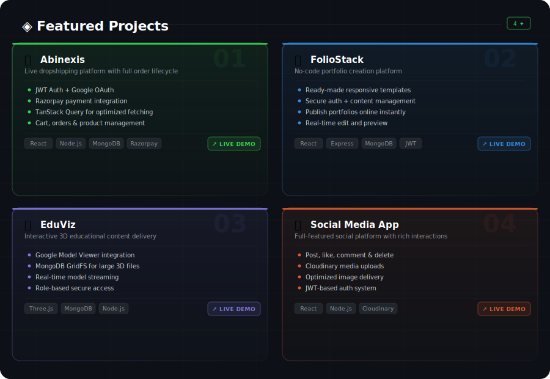

<div align="center">

<!-- DYNAMIC BANNER -->


<!-- TYPING ANIMATION -->
<a href="https://git.io/typing-svg">
  
</a>

<br/>

<!-- SOCIAL BADGES -->
<a href="https://linkedin.com/in/dhusyanth-s" target="_blank">
  
</a>
<a href="https://github.com/Dhusyanth2005" target="_blank">
  
</a>
<a href="https://leetcode.com/Dhusyanth2005" target="_blank">
  
</a>
<a href="https://www.codechef.com/users/dhusyanth" target="_blank">
  
</a>
<a href="mailto:dhusyanth.s2023it@sece.ac.in" target="_blank">
  
</a>

<br/><br/>


</div>

---

## ◈ Who Am I

```typescript
const dhusyanth = {
  name        : "Dhusyanth S",
  role        : "Full Stack Developer (MERN)",
  location    : "Tamil Nadu, India 🇮🇳",
  education   : "B.Tech IT @ Sri Eshwar College of Engineering (2023–2027)",
  cgpa        : 7.88,
  experience  : "Full Stack Intern @ Code Kadai Solutions (6 months)",
  focus       : ["Scalable Web Apps", "REST APIs", "3D Web Experiences"],
  currentlyOn : "Building production-grade MERN applications",
  openTo      : ["Full-Time Roles", "Internships", "Freelance Projects"],
};
```

---

## ◈ Tech Arsenal

<div align="center">

### ⚡ Languages


### 🎨 Frontend


### 🔧 Backend & Database


### 🛠 Tools & Platforms


</div>

---

## ◈ Featured Projects
 
<div align="center">
  
</div>
---

## ◈ GitHub Metrics

<div align="center">


<br/>


</div>

---

## ◈ Coding Battlefield

<div align="center">

<table>
<tr>
<td align="center">
  <a href="https://leetcode.com/Dhusyanth2005">
    <br/>
    <b>300+ Problems</b><br/>
    <sub>Max Rating: 1747</sub>
  </a>
</td>
<td align="center">
  <a href="https://www.codechef.com/users/dhusyanth">
    <br/>
    <b>100+ Problems</b><br/>
    <sub>Max Rating: 941</sub>
  </a>
</td>
<td align="center">
  <br/>
  <b>200+ Problems</b><br/>
  <sub>Active Solver</sub>
</td>
</tr>
</table>

</div>

---

## ◈ Contribution Graph

<div align="center">


</div>

---

## ◈ Achievements & Honors

<div align="center">

| 🏆 Achievement | 🏛 Organization | 📅 Year |
|:---|:---|:---:|
| 🥇 **Winner** — Mini Project Expo 2K25 | Sri Eshwar College of Engineering | 2025 |
| 🥇 **Winner** — Project Expo *(₹2,000 Cash Prize)* | Sri Ramakrishna Institute of Technology | 2025 |
| 🥇 **Winner** — ZeroDay 24-Hour Startup Hackathon *(₹3,000 Cash Prize)* | Inter-Department Level | 2025 |

</div>

---

## ◈ Certifications

<div align="center">


</div>

---

## ◈ Let's Connect

<div align="center">

> *"I don't just write code — I architect experiences."*

<br/>

<a href="https://linkedin.com/in/dhusyanth-s">
  
</a>
&nbsp;
<a href="mailto:dhusyanth.s2023it@sece.ac.in">
  
</a>
&nbsp;
<a href="https://github.com/Dhusyanth2005">
  
</a>

<br/><br/>


</div>
